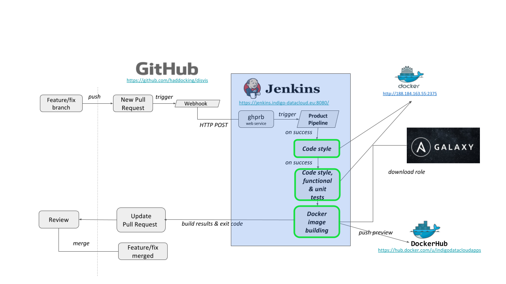

# A1. Annex {.page_break_before}

The Quality Criteria described in this document is abstract, as such the choice of tools
and services to implement their verification is up to the team or community developing
and/or using a given software.

The annex describes the implementation of how the Quality Criteria detailed in this
document can be verified, and as has been used in several European projects. It details the
code workflow, the tools and services used to achieve the verification of the Criteria.

## A1.1. List of tools and services

Table @tbl:services show the list of tools and services used for the source code management as well
as to implement the verification of the Quality Criteria detailed in this document.

The main service used for Software source code management has been Github. It is uses git as Version
Control System, branching and tag management. Additionally has an issue tracker for bugs, requests
and enhancements and the mechanism of Pull Requests for code review and discussion of changes.

Ansible and Ansible-Galaxy are used in many software frameworks as deployment and configuration
tools.

The software is packed/built into executable artifacts that can be RPMs (case of RedHat and
derivative OS), DEBs (case of Debian/Ubuntu and derivatives) and in many cases into docker images.

The artifacts are provided, in general, by public repositories and most notably Dockerhub in the case
of docker images. Other common repositories are PyPI for python SW or modules and Maven for Java.

Regarding the CI/CD criteria, Jenkins CI tool is used and details are given in section A1.3.

| Service/Tool    | Usage              | Criteria   | Comment                                      |
|:---------------:|:------------------:|:----------:|:--------------------------------------------:|
| Github          | VCS                | **QC.Acc** | Source code repository - git                 |
|                 | Code Workflow      | **QC.Wor** | git branching management and version tagging |
|                 | Issue tracker      | **QC.Man** | Track issues, bugs, new features, etc.       |
|                 | Pull Requests (PR) | **QC.Man**, **QC.Rev** | Code review through PRs          |
|                 | Documentation      | **QC.Doc** | Documentation present in VCS repository (markdown) |
| Ansible, Galaxy | Install, Config    | **QC.Aud** | Automated deployment and configuration       |

Table: Tools and services used to implement the QA criteria, also shown the criteria
where applicable. {#tbl:services}

## A1.2. Code workflow

This section describes the code workflow shown in Figure @fig:workflow

{height="500px"}{#fig:workflow}

## A1.3. Jenkins CI

This section details the tools being used (and planned) in the Jenkins CI pipelines, the criteria
that it verifies, applicable programming language.

| Tool         | Criteria   | Programming Language | Repo URL or documentation | Summary           |
|:------------:|:----------:|:--------------------:|:-------------------------:|:-----------------:|
| pylint       | **QC.Sty** | Python     | <https://pylint.org/>                      | Code style |
| hadolint     | **QC.Sty** | Dockerfile | <https://github.com/hadolint/hadolint>     | Code style |
| checkstyle   | **QC.Sty** | Java       | <https://github.com/checkstyle/checkstyle> | Code style |
| jsonlint     | **QC.Sty** | JSON       | <https://github.com/zaach/jsonlint>        | Code style |
| bandit       | **QC.Sec** | Python     | <https://bandit.readthedocs.io/>           | Static security |
| pycodestyle  | **QC.Sty** | Python     | <https://pycodestyle.pycqa.org/en/latest/> | Code style |
| tox          | **QC.Sty**/**QC.Uni**/**QC.Fun**/**QC.Sec**/**QC.Doc** | Python     | <https://tox.wiki/en/latest/>              | Automated test framework |
| licensee     | **QC.Lic** | Agnostic   | <https://github.com/licensee/licensee>     | Check license |
| checkLicense | **QC.Lic** | Agnostic   | <https://github.com/EOSC-synergy/sqa-composer-templates/tree/main/QC.Lic> | Check license |
| checkCitable | **QC.Acc** | Agnostic   | <https://github.com/EOSC-synergy/sqa-composer-templates/tree/main/QC.Acc> | Code metadata |

