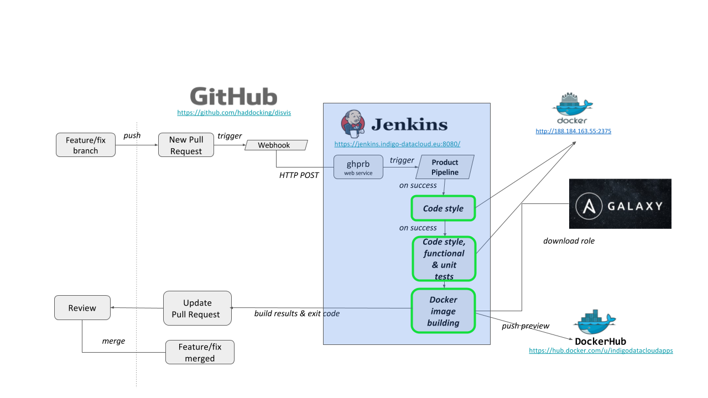

---
title: A set of Common Software Quality Assurance Baseline Criteria for Research Projects
keywords:
- research software
- software quality assurance
- software lifecycle
- devops
- software automation
- software quality baseline
- software testing
- software deployment
- agile development
lang: en-US
date-meta: '2023-01-09'
author-meta:
- Pablo Orviz
- Mario David
- Isabel Campos
- Jorge Gomes
- Germán Moltó
- Vyacheslav Tykhonov
- Doina Cristina Duma
- Alvaro Lopez
- Giacinto Donvito
header-includes: |-
  <!--
  Manubot generated metadata rendered from header-includes-template.html.
  Suggest improvements at https://github.com/manubot/manubot/blob/main/manubot/process/header-includes-template.html
  -->
  <meta name="dc.format" content="text/html" />
  <meta name="dc.title" content="A set of Common Software Quality Assurance Baseline Criteria for Research Projects" />
  <meta name="citation_title" content="A set of Common Software Quality Assurance Baseline Criteria for Research Projects" />
  <meta property="og:title" content="A set of Common Software Quality Assurance Baseline Criteria for Research Projects" />
  <meta property="twitter:title" content="A set of Common Software Quality Assurance Baseline Criteria for Research Projects" />
  <meta name="dc.date" content="2023-01-09" />
  <meta name="citation_publication_date" content="2023-01-09" />
  <meta name="dc.language" content="en-US" />
  <meta name="citation_language" content="en-US" />
  <meta name="dc.relation.ispartof" content="Manubot" />
  <meta name="dc.publisher" content="Manubot" />
  <meta name="citation_journal_title" content="Manubot" />
  <meta name="citation_technical_report_institution" content="Manubot" />
  <meta name="citation_author" content="Pablo Orviz" />
  <meta name="citation_author_institution" content="Spanish National Research Council (CSIC)" />
  <meta name="citation_author_institution" content="Institute of Physics of Cantabria (IFCA)" />
  <meta name="citation_author_orcid" content="0000-0002-2473-6405" />
  <meta name="citation_author" content="Mario David" />
  <meta name="citation_author_institution" content="Laboratory of Instrumentation and Experimental Particle Physics (LIP)" />
  <meta name="citation_author_orcid" content="0000-0003-1802-5356" />
  <meta name="citation_author" content="Isabel Campos" />
  <meta name="citation_author_institution" content="Spanish National Research Council (CSIC)" />
  <meta name="citation_author_institution" content="Institute of Physics of Cantabria (IFCA)" />
  <meta name="citation_author_orcid" content="0000-0002-9350-0383" />
  <meta name="citation_author" content="Jorge Gomes" />
  <meta name="citation_author_institution" content="Laboratory of Instrumentation and Experimental Particle Physics (LIP)" />
  <meta name="citation_author_orcid" content="0000-0002-9142-2596" />
  <meta name="citation_author" content="Germán Moltó" />
  <meta name="citation_author_institution" content="Universitat Politècnica de València (UPV)" />
  <meta name="citation_author_orcid" content="0000-0002-8049-253X" />
  <meta name="citation_author" content="Vyacheslav Tykhonov" />
  <meta name="citation_author_institution" content="DANS-KNAW" />
  <meta name="citation_author_orcid" content="0000-0001-9447-9830" />
  <meta name="citation_author" content="Doina Cristina Duma" />
  <meta name="citation_author_institution" content="National Institute of Nuclear Physics (INFN)" />
  <meta name="citation_author_orcid" content="0000-0002-0124-4870" />
  <meta name="citation_author" content="Alvaro Lopez" />
  <meta name="citation_author_institution" content="Spanish National Research Council (CSIC)" />
  <meta name="citation_author_institution" content="Institute of Physics of Cantabria (IFCA)" />
  <meta name="citation_author_orcid" content="0000-0002-0013-4602" />
  <meta name="citation_author" content="Giacinto Donvito" />
  <meta name="citation_author_institution" content="National Institute of Nuclear Physics (INFN)" />
  <meta name="citation_author_orcid" content="0000-0002-0628-1080" />
  <link rel="canonical" href="https://indigo-dc.github.io/sqa-baseline/" />
  <meta property="og:url" content="https://indigo-dc.github.io/sqa-baseline/" />
  <meta property="twitter:url" content="https://indigo-dc.github.io/sqa-baseline/" />
  <meta name="citation_fulltext_html_url" content="https://indigo-dc.github.io/sqa-baseline/" />
  <meta name="citation_pdf_url" content="https://indigo-dc.github.io/sqa-baseline/manuscript.pdf" />
  <link rel="alternate" type="application/pdf" href="https://indigo-dc.github.io/sqa-baseline/manuscript.pdf" />
  <link rel="alternate" type="text/html" href="https://indigo-dc.github.io/sqa-baseline/v/a4eb7d5550ed5bbbfa78f08222d99fab2cbf1670/" />
  <meta name="manubot_html_url_versioned" content="https://indigo-dc.github.io/sqa-baseline/v/a4eb7d5550ed5bbbfa78f08222d99fab2cbf1670/" />
  <meta name="manubot_pdf_url_versioned" content="https://indigo-dc.github.io/sqa-baseline/v/a4eb7d5550ed5bbbfa78f08222d99fab2cbf1670/manuscript.pdf" />
  <meta property="og:type" content="article" />
  <meta property="twitter:card" content="summary_large_image" />
  <link rel="icon" type="image/png" sizes="192x192" href="https://manubot.org/favicon-192x192.png" />
  <link rel="mask-icon" href="https://manubot.org/safari-pinned-tab.svg" color="#ad1457" />
  <meta name="theme-color" content="#ad1457" />
  <!-- end Manubot generated metadata -->
bibliography:
- content/manual-references.json
manubot-output-bibliography: output/references.json
manubot-output-citekeys: output/citations.tsv
manubot-requests-cache-path: ci/cache/requests-cache
manubot-clear-requests-cache: false
...

 
{height="50px"}&nbsp;&nbsp;&nbsp;&nbsp;
{height="50px"}&nbsp;&nbsp;&nbsp;&nbsp;
{height="50px"}&nbsp;&nbsp;&nbsp;&nbsp;
{height="50px"}

_A DOI-citable version of this manuscript is available at <http://hdl.handle.net/10261/160086>_.

<small><em>
This manuscript
([permalink](https://indigo-dc.github.io/sqa-baseline/v/a4eb7d5550ed5bbbfa78f08222d99fab2cbf1670/))
was automatically generated
from [indigo-dc/sqa-baseline@a4eb7d5](https://github.com/indigo-dc/sqa-baseline/tree/a4eb7d5550ed5bbbfa78f08222d99fab2cbf1670)
on January 9, 2023 with the use of <https://gitlab.com/manubot/rootstock/>.
</em></small>

## Authors

+ **Pablo Orviz** 
    {.inline_icon}
    [0000-0002-2473-6405](https://orcid.org/0000-0002-2473-6405)
    · {.inline_icon}
    [orviz](https://github.com/orviz) 
  <small>
     Spanish National Research Council (CSIC); Institute of Physics of Cantabria (IFCA)
  </small>

+ **Mario David** 
    {.inline_icon}
    [0000-0003-1802-5356](https://orcid.org/0000-0003-1802-5356)
    · {.inline_icon}
    [mariojmdavid](https://github.com/mariojmdavid) 
  <small>
     Laboratory of Instrumentation and Experimental Particle Physics (LIP)
  </small>

+ **Isabel Campos** 
    {.inline_icon}
    [0000-0002-9350-0383](https://orcid.org/0000-0002-9350-0383)
    · {.inline_icon}
    [isabel-campos-plasencia](https://github.com/isabel-campos-plasencia) 
  <small>
     Spanish National Research Council (CSIC); Institute of Physics of Cantabria (IFCA)
  </small>

+ **Jorge Gomes** 
    {.inline_icon}
    [0000-0002-9142-2596](https://orcid.org/0000-0002-9142-2596)
    · {.inline_icon}
    [jorge-lip](https://github.com/jorge-lip) 
  <small>
     Laboratory of Instrumentation and Experimental Particle Physics (LIP)
  </small>

+ **Germán Moltó** 
    {.inline_icon}
    [0000-0002-8049-253X](https://orcid.org/0000-0002-8049-253X)
    · {.inline_icon}
    [gmolto](https://github.com/gmolto) 
  <small>
     Universitat Politècnica de València (UPV)
  </small>

+ **Vyacheslav Tykhonov** 
    {.inline_icon}
    [0000-0001-9447-9830](https://orcid.org/0000-0001-9447-9830)
    · {.inline_icon}
    [4tikhonov](https://github.com/4tikhonov) 
  <small>
     DANS-KNAW
  </small>

+ **Doina Cristina Duma** 
    {.inline_icon}
    [0000-0002-0124-4870](https://orcid.org/0000-0002-0124-4870)
    · {.inline_icon}
    [caifti](https://github.com/caifti) 
  <small>
     National Institute of Nuclear Physics (INFN)
  </small>

+ **Alvaro Lopez** 
    {.inline_icon}
    [0000-0002-0013-4602](https://orcid.org/0000-0002-0013-4602)
    · {.inline_icon}
    [alvaro.lopez](https://github.com/alvaro.lopez) 
  <small>
     Spanish National Research Council (CSIC); Institute of Physics of Cantabria (IFCA)
  </small>

+ **Giacinto Donvito** 
    {.inline_icon}
    [0000-0002-0628-1080](https://orcid.org/0000-0002-0628-1080) 
  <small>
     National Institute of Nuclear Physics (INFN)
  </small>

# Abstract {.page_break_before}

The purpose of this document is to define a set of quality standards, procedures and best practices
to conform a Software Quality Assurance plan to serve as a reference within the European research
ecosystem related projects for the adequate development and timely delivery of software products.

# Copyright Notice

Copyright © Members of the INDIGO-DataCloud, DEEP Hybrid-DataCloud eXtreme DataCloud and
EOSC-Synergy collaborations, 2015-2021.

# Acknowledgements

The INDIGO-DataCloud, DEEP-Hybrid-DataCloud, eXtreme-DataCloud and EOSC-Synergy projects have
received funding from the European Union’s Horizon 2020 research and innovation programme under
grant agreement number 653549, 777435, 777367 and 857647 respectively.

  

# Document Log {.page_break_before}

| Issue | Date       | Comment                                        |
|-------|------------|------------------------------------------------|
| v1.0  | 31/01/2018 | First draft version                            |
| v2.0  | 05/02/2018 | Updated criteria                               |
| v3.0  | 20/12/2019 | Code management section, metadata for software |
| v3.1  | 05/03/2020 | Add tags/names for each criteria               |
| v3.2  | 23/04/2020 | Add EOSC-Synergy to copyright                  |
| v3.3  | 15/10/2020 | Fix issues: #32, #46, #47, #48, #49, #51       |
| v4.0  | 02/02/2022 | Add annex, spell check, Fix issues: #7, #35, #50, #57, #59, #60, #61, #63, #64, #65, #66, #67, #69, #70, #71, #72, #73, #74, #75, #76, #77, #78, #80, #81 |
| v4.1  | 24/10/2022 | update pipeline tools, Fix issues: #68, #83, #85, #88, #90, #91, #92 |

# 1. Introduction and Purpose {.page_break_before}

This document has been tailored upon the recommendations and requirements found in the Initial Plan
for Software Management and Pilot Services deliverable
[@url:https://owncloud.indigo-datacloud.eu/index.php/s/yDklCrWjKnjutVA], produced by the
INDIGO-DataCloud project.

These guidelines evolved throughout the project’s lifetime and are being extended in the
EOSC-Synergy [@doi:10.20350/digitalCSIC/12607], as well as the past DEEP-Hybrid-DataCloud and
eXtreme DataCloud subsequent projects.

The result is a consolidated Software Quality Assurance (SQA) baseline criteria emanated from the
European Open Science Cloud (EOSC), which aims to outline the SQA principles to be considered in the
upcoming software development efforts within the European research community, and continuously
evolve in order to be aligned with future software engineering practices and security
recommendations.

# 2. Goals

1. Set the base of minimum SQA criteria that a software developed within EOSC development project
   MUST fulfill.

2. Enhance the visibility, accessibility and distribution of the produced source code through the
   alignment to the Open Source Definition [@https://opensource.org/osd].

3. Promote code style standards to deliver good quality source code emphasizing its readability and
   reusability.

4. Improve the quality and reliability of software by covering different testing methods at
   development and pre-production stages.

5. Propose a change-based driven scenario where all new updates in the source code are continuously
   validated by the automated execution of the relevant tests.

6. Adopt an agile approach to effectively produce timely and audience-specific documentation.

7. Lower the barriers of software adoption by delivering quality documentation and the utilization
   of automated deployment solutions.

8. Encourage secure coding practices and security static analysis at the development phase while
   providing recommendations on external security assessment.

# 3. Notational Conventions

The keywords "MUST", "MUST NOT", "REQUIRED", "SHALL", "SHALL NOT", "SHOULD", "SHOULD NOT",
"RECOMMENDED", "MAY", and "OPTIONAL" in this document are to be interpreted as described in RFC 2119
[@https://www.rfc-editor.org/info/rfc2119].

# 4. Quality Criteria {.page_break_before}

The following sections describe the quality conventions and best practices that apply to the
development phase of a software component within the EOSC ecosystem. These guidelines ruled the
software development process of the former European Commission-funded project INDIGO-DataCloud,
where they have proved valuable for improving the reliability of software produced in the scientific
European arena.

The next sections describe the development process driven by a change-based strategy, followed by a
continuous integration approach. Changes in the source code, trigger automated builds to analyze the
new contributions in order to validate them before being added to the software component code base.
Consequently, software components are more eligible for deployment in production infrastructures,
reducing the likelihood of service disruption.

## 4.1. Code handling

### 4.1.1. Code Accessibility [QC.Acc]

* **[QC.Acc01]** Following the open-source model, the source code being produced **MUST** be open
  and publicly available to promote the adoption and augment the visibility of the software
  developments.

* **[QC.Acc02]** Source code **MUST** use a Version Control System (VCS).

  * **[QC.Acc02.1]** It is **RECOMMENDED** that all software components delivered by the same
    project agree on a common VCS.

* **[QC.Acc03]** Source code produced within the scope of a broader development project **SHOULD**
  reside in a common organization of a version control repository hosting service.

### 4.1.2. Code Workflow [QC.Wor]

A change-based approach is accomplished with a branching model.

* **[QC.Wor01]** The main branch in the source code repository **MUST** maintain a working state
  version of the software component.

  * **[QC.Wor01.1]** Main branch **SHOULD** be protected to disallow force pushing, thus preventing
    untested and un-reviewed source code from entering the production-ready version.

  * **[QC.Wor01.2]** New features **SHOULD** only be merged in the main branch whenever the SQA
    criteria is fulfilled.

* **[QC.Wor02]** New changes in the source code **MUST** be placed in individual branches.

  * **[QC.Wor02.1]** It is **RECOMMENDED** to agree on a branch nomenclature, usually by prefixing,
    to differentiate change types (e.g. feature, release, fix).

* **[QC.Wor03]** The existence of a secondary long-term branch that contains the changes for the
  next release is **RECOMMENDED**.

  * **[QC.Wor03.1]** Next release changes **SHOULD** come from the individual branches.

  * **[QC.Wor03.2]** Once ready for release, changes in the secondary long-term branch are merged
    into the main branch and versioned. At that point in time, main and secondary branches are
    aligned. This step **SHOULD** mark a production release.

### 4.1.3. Code Management [QC.Man]

* **[QC.Man01]** An issue tracking system facilitates structured software development. Leveraging
  issues to track down both new enhancements and defects (bugs, documentation typos) is
  **RECOMMENDED**.

  * **[QC.Man01.1]** In addition to monitoring the internal development, issues are the best means
    for supporting users. External users **SHOULD** be able to create issues based on the
    operational performance of the software.

  * **[QC.Man01.2]** The description of an issue **SHOULD** be concise and state clearly the
   problem. It is **RECOMMENDED** to add any reference to the actual problem. In the case of bugs,
   the issue **SHOULD** be accompanied by the relevant debug information.
         * The usage of templates for the issue description is **RECOMMENDED**.

* **[QC.Man02]** In social coding environments, pull or merge requests represent the cornerstone of
  collaboration. A pull or merge request provides a place for review and discussion of the changes
  proposed to be part of an existing version of the code.

  * **[QC.Man02.1]** Pull/Merge requests **SHOULD** be used for every change in the codebase.

  * **[QC.Man02.2]** A software project **SHOULD** be open to external collaboration through
    pull/merge requests.

  * **[QC.Man02.3]** A pull/merge request description **SHOULD** be concise and state clearly its
    purpose (e.g. if it is fixing an observed bug or adding a new feature).

  * **[QC.Man02.4]** The usage of templates for the pull/merge request's description is
    **RECOMMENDED**.

  * **[QC.Man02.5]** It is **RECOMMENDED** to use pull/merge requests to address open issues.

  * **[QC.Man02.6]** The pull/merge request description **SHOULD** make reference to the identifiers
    of the issues it is fixing (to eventually close them, either manually or automatically).

### 4.1.4. Code Review [QC.Rev]

Code review implies the informal, non-automated, peer review of any change in the source code
[@https://owasp.org/www-project-code-review-guide/migrated_content]. It appears as the last step in
the change management pipeline, once the candidate change has successfully passed over the required
set of change-based tests.

* **[QC.Rev01]** Code reviews **MUST** be done in the agreed peer review tool within the project,
  with the following RECOMMENDED functionality:

  * **[QC.Rev01.1]** Allows general and specific comments on the line or lines that need to be
    reviewed.

  * **[QC.Rev01.2]** Shows the results of the required change-based test executions.

  * **[QC.Rev01.3]** Allows to prevent merges of the candidate change whenever not all the required
    tests are successful. Exceptions to this rule cover the third-party or upstream contributions
    which MAY use the existing mechanisms or tools for code review provided by the target software
    project. This exception **MUST** only be allowed whenever the external revision lifecycle does
    not interfere with the project deadlines.

* **[QC.Rev02]** Code reviews **MUST** be open and collaborative, allowing external experts
  revisions.

* **[QC.Rev03]** Code reviews **SHOULD** be concise and use neutral language. The areas where the
  reviewers MAY focus are:

  * **[QC.Rev03.1]** Message description: commit message is clear, self-explanatory and describes
    precisely the objectives being addressed.

  * **[QC.Rev03.2]** Goal or scope: change is needed and/or addresses/fixes the whole set of
    objectives.

  * **[QC.Rev03.3]** Code analysis: useless statements in the code, library or modules imported but
    never used or code style suggestions.

  * **[QC.Rev03.4]** Review of required tests: check if they include tests of the changes, such as
    tests of new features, or tests of bug fixing (regression tests), ensuring proper validation of
    the changes.

  * **[QC.Rev03.5]** Review of documentation: whether the change **SHOULD** bring along a
    corresponding update in the documentation.

* **[QC.Rev04]** Code reviews **MUST** be checked on change basis.

* **[QC.Rev05]** Code reviews **SHOULD** assess the inherent security risk of the changes, ensuring
  that the security model has not been downgraded or compromised by the changes.

### 4.1.5. Semantic Versioning [QC.Ver]

* **[QC.Ver01]** Semantic Versioning [@https://semver.org] specification is **RECOMMENDED** for
  tagging the production releases.

## 4.2. Files and documents

### 4.2.1. Licensing [QC.Lic]

* **[QC.Lic01]** As open-source software, source code **MUST** adhere to an open-source license to
  be freely used, modified and distributed by others. Non-licensed software is exclusive copyright
  by default.

  * **[QC.Lic01.1]** Licenses **MUST** be physically present (e.g. as a LICENSE file) in the root
  of all the source code repositories related to the software component.

* **[QC.Lic02]** License **MUST** be compliant with the Open Source Definition
  [@https://opensource.org/osd].

  * **[QC.Lic02.1]** **RECOMMENDED** licenses are listed in the Open Source Initiative portal under
    the Popular Licenses category [@https://opensource.org/licenses], c.f. the complete list of
    Software Package Data Exchange (SPDX) [@https://spdx.org/licenses].

### 4.2.2. Code metadata [QC.Met]

Metadata for the software component provides a way to achieve its full identification, thus making
software citation viable [@doi:10.7717/peerj-cs.86]. It allows the assignment of a Digital Object
Identifier (DOI) and is key towards preservation, discovery, reuse, and attribution of the software
component.

* **[QC.Met01]** A metadata file **SHOULD** exist along side the code, under its VCS. The metadata
  file **SHOULD** be updated when needed, as is the case of a new version.

### 4.2.3. Documentation [QC.Doc]

* **[QC.Doc01]** Documentation **MUST** be treated as code.

  * **[QC.Doc01.1]** Version controlled, it **MAY** reside in the same repository where the source
    code lies.

* **[QC.Doc02]** Documentation **MUST** use plain text format using a markup language, such as
  Markdown or reStructuredText.

  * **[QC.Doc02.1]** It is **RECOMMENDED** that all software components delivered by the same
    project agree on a common markup language.
  * **[QC.Doc2.2]** Each individual documentation file **SHOULD** comply with community-driven or
    de-facto style standards for the markup languages being used.

* **[QC.Doc03]** Documentation **MUST** be online and available in a documentation repository.

  * **[QC.Doc03.1]** Documentation **SHOULD** be rendered automatically.

* **[QC.Doc04]** Documentation **MUST** be updated on new software versions involving any
  substantial or minimal change in the behavior of the application.

* **[QC.Doc05]** Documentation **MUST** be updated whenever reported as inaccurate or unclear.

* **[QC.Doc06]** Documentation **MUST** be produced according to the target audience, varying
  according to the software component specification. The identified types of documentation and their
  RECOMMENDED content are:

  * **[QC.Doc06.1]** README file **MUST** be present:

    * One-paragraph description of the application.
    * A *"Getting Started"* step-by-step description on how to get a development environment running
      (prerequisites, installation).
    * Automated test execution how-to.
    * Links to the external documentation below (production deployment, user guides).
    * Versioning specification.
    * Author list and contacts.
    * Acknowledgments.

  * **[QC.Doc06.2]** CONTRIBUTING file **MUST** be present in order to communicate how external
    parties can contribute to the code.

  * **[QC.Doc06.3]** A code of conduct (usually defined in a CODE_OF_CONDUCT file) **MUST** be
    present in order to establish the positive social attitudes expected within the community of
    code contributors.

  * **[QC.Doc06.4]** LICENSE file **MUST** be present, License information with detailed description.

  * **[QC.Doc06.5]** Developer

    * Private API documentation.
    * Structure and interfaces.
    * Build documentation.

  * **[QC.Doc06.6]** Deployment and Administration

    * Installation and configuration guides.
    * Service Reference Card, with the following RECOMMENDED content:
      * Brief functional description.
      * List of processes or daemons.
      * Init scripts and options.
      * List of configuration files, location and example or template.
      * Log files location and other useful audit information.
      * List of ports.
      * Service state information.
      * List of cron jobs.
    * Security information.
    * FAQs and troubleshooting.

  * **[QC.Doc06.7]** User

    * Public API documentation.
    * Command Line Interface (CLI) reference.

## 4.3. Static testing - White box testing

### 4.3.1. Code Style [QC.Sty]

Code style requirements pursue the correct maintenance of the source code by the common agreement of
a series of style conventions. These vary based on the programming language being used.

* **[QC.Sty01]** Each individual software product **MUST** comply with community-driven or de-facto
  code style standards for the programming languages being used.

  * **[QC.Sty01.1]** Compliance with multiple complementary standards **MAY** exist.

* **[QC.Sty02]** Custom code style guidelines **SHOULD** be avoided, only considered in the
  hypothetical event of programming languages without existing community style standards.

  * **[QC.Sty02.1]** Custom styles **MUST** be documented by defining each convention and its
    expected output.

  * **[QC.Sty02.2]** Custom styles **SHOULD** evolve over time towards a more consistent definition.

* **[QC.Sty03]** Exceptions of individual conventions from the main definition are allowed but
  **SHOULD** be avoided

  * **[QC.Sty03.1]** Absence of standard conventions **SHOULD** be justified and tracked.

* **[QC.Sty04]** Code style compliance testing **MUST** be automated and **MUST** be triggered for
  each candidate change in the source code.

### 4.3.2. Unit Testing [QC.Uni]

Unit testing evaluates all the possible flows in the internal design of the code, so that its
behavior becomes apparent. It is a key type of testing for early detection of failures in the
development cycle.

* **[QC.Uni01]** Minimum acceptable code coverage threshold **SHOULD** be 70%.

  * **[QC.Uni01.1]** Unit testing coverage **SHOULD** be higher for those sections of the code
    identified as critical by the developers, such as units part of a security module.

  * **[QC.Uni01.2]** Unit testing coverage **MAY** be lower for external libraries or pieces of code
    not maintained within the product’s code base.

* **[QC.Uni02]** Units **SHOULD** reside in the repository code but separated from the main code.

* **[QC.Uni03]** Unit testing coverage **MUST** be checked on change basis.

* **[QC.Uni04]** Unit testing coverage **MUST** be automated.

### 4.3.3. Test Harness [QC.Har]

In software development, a test harness
[@https://searchsoftwarequality.techtarget.com/definition/test-harness], is a collection of software
and test data used by developers to unit test software models during development. A test harness
will specifically refer to test doubles, which are programs that interact with the software being
tested. Once a test harness is used to execute a test, they can also utilize a test library to
generate reports.

It is also a simple form of Integration Testing, where interaction and integration with external
components are substituted by a Double.

Test Double is a generic term for any case where you replace a production object for testing
purposes. There are various kinds of double [@isbn:9780131495050]:

* **Dummy objects** are passed around but never actually used. Usually they are just used to fill
  parameter lists.

* **Fake objects** actually have working implementations, but usually take some shortcut which makes
  them not suitable for production (such as an InMemoryTestDatabase).

* **Stubs** provide canned answers to calls made during the test, usually not responding at all to
  anything outside what's programmed in for the test.

* **Spies** are stubs that also record some information based on how they were called. One form of
  this might be an email service that records how many messages where sent.

* **Mocks** are pre-programmed with expectations which form a specification of the calls they are
  expected to receive. They can throw an exception if they receive a call they don't expect and are
  checked during verification to ensure they got all the calls they were expecting.

As such the following criteria is defined for Test Harness:

* **[QC.Har01]** When working on automated testing, the use of Test Doubles is **RECOMMENDED** to
  mimic a simplistic behavior of objects and procedures.

* **[QC.Har02]** Test Doubles **SHOULD** reside in the software component repository code base but
  separated from the main code.

* **[QC.Har03]** Regression testing, that checks the conformance with previous tests, **SHOULD** be
  covered at this stage by executing the complete set of Test Doubles available.

* **[QC.Har04]** Test Doubles and regression, **MUST** be checked on change basis.

### 4.3.4. Test-Driven Development [QC.Tdd]

Test-Driven Development [@isbn:9780321146533], is a software development process relying on software
requirements being converted to test cases before software is fully developed, and tracking all
software development by repeatedly testing the software against all test cases. This is opposed to
software being developed first and test cases created later.

* **[QC.Tdd01]** Software requirements **SHOULD** be converted to test cases, and these test cases
  **SHOULD** be checked automatically.

### 4.3.5. Security [QC.Sec]

Security assessment is essential for any production **Software**. An effective implementation of the
security requirements applies to every stage in the Software Development Life Cycle (SDLC),
especially effective at the source code level.

* **[QC.Sec01]** Secure coding practices **MUST** be applied into all the stages of a software
  component development lifecycle.

  * **[QC.Sec01.1]** Compliance with Open Web Application Security Project (OWASP) secure coding
    guidelines
    [@https://owasp.org/www-project-secure-coding-practices-quick-reference-guide/migrated_content]
    is **RECOMMENDED**, even for non-web applications.

* **[QC.Sec02]** Source code **MUST** use automated linter tools to perform static application
  security testing (SAST) [@https://owasp.org/www-community/Source_Code_Analysis_Tools] that flag
  common suspicious constructs that may cause a bug or lead to a security risk (e.g. inconsistent
  data structure sizes or unused resources).

* **[QC.Sec03]** Security code reviews
  [@https://owasp.org/www-project-code-review-guide/migrated_content]
  for certain vulnerabilities **SHOULD** be done as part of the identification of potential security
  flaws in the code. Inputs **SHOULD** come from automated linters.

* **[QC.Sec04]** World-writable files or directories **MUST NOT** be present in the product’s
  configuration or logging locations.

## 4.4. Delivery

### 4.4.1. Automated Delivery [QC.Del]

Automated delivery comprises the build of Software into an artifact, its upload/registration into a
public repository of such artifacts and notification of the success of the process.

* **[QC.Del01]** Production-ready code **MUST** be built as an artifact that can be efficiently
  executed on a system.

  * **[QC.Del01.1]** The built artifact **SHOULD** be as minimal as possible, including no more than
    the precise runtime environment and dependencies required for the execution of the software.

* **[QC.Del02]** The built artifact **MUST** be uploaded and registered into a public repository
  of such artifacts.

* **[QC.Del03]** Upon success of the previous (**QC.Del02**) process, a notification **MUST** be
  sent to pre-defined parties such as the main developer or team.

## 4.5. Deployment

### 4.5.1. Automated Deployment [QC.Dep]

* **[QC.Dep01]** Production-ready code **MUST** be deployed as a workable system with the minimal
  user or system administrator interaction leveraging software configuration management (SCM) tools.

* **[QC.Dep02]** A SCM module is treated as code.

  * **[QC.Dep02.1]** Version controlled, it **SHOULD** reside in a different repository than the
    source code to facilitate the distribution.

* **[QC.Dep03]** It is **RECOMMENDED** that all software components delivered by the same project
  agree on a common SCM tool.

  * **[QC.Dep03.1]** However, software products **MAY** not be restricted to provide a unique
    solution for the automated deployment.

* **[QC.Dep04]** Any change affecting the application’s deployment or operation **MUST** be
  subsequently reflected in the relevant SCM modules.

* **[QC.Dep05]** Official repositories provided by the main developer **SHOULD** be used to host the
  SCM modules, thus augmenting the visibility and promote external collaboration.

# 5. Glossary {.page_break_before}

__API__
: Application Programming Interface

__CLI__
: Command Line Interface

__EOSC__
: European Open Science Cloud

__OWASP__
: Open Web Application Security Project

__SAST__
: Static Application Security Testing

__SCM__
: Software Configuration Management

__SQA__
: Software Quality Assurance

__TDD__
: Test-Driven Development

__VCS__
: Version Control System

# A1. Annex {.page_break_before}

The Quality Criteria described in this document follows a technology-agnostic approach, as such the
choice of tools and services to implement the code workflow, followed by the verification &
validation processes, is up to the team or community developing and/or using a given software.

This annex describes an implementation approach to help software developers cover the Quality
Criteria detailed in this document.

## A1.1. Code workflow

The code workflow is shown in Figure @fig:workflow. It depicts a real case example, Github is used
for several purposes that will be described below. The workflow starts when the developer branches
the code to implement a given new feature or fix, after the implementation the Pull Request triggers
a CI pipeline in the Jenkins service.

In the Jenkins service, several checks are performed, both on the code (static), such as code style
linting, as well as dynamic tests such as unit and harness tests. To perform functional tests that
may include API tests in case of a service, the packages will need to be built (delivery), and
automatically deployed into a running state. In the case shown, the configuration is done with
ansible roles and playbooks.

The Pull Request is updated with the results of the tests, thus notifying the developer team that
they can proceed with the review and, if approved, with the release process where the branch is
merge into the main production branch.

{height="500px"}{#fig:workflow}

## A1.2. Verification & Validation (V&V) {.page_break_before}

Once having the code workflow, the next step is to shape the V&V processes in order to ensure that
the software does "the right things right". One way to address them is to rely on CI/CD pipelines
that encompass the series of checks that will be executed automatically for each change done in
the code, driven by the agreed code workflow (see A1.1).

There are multiple technological solutions to compose CI/CD pipelines. The **SQA as a Service
(SQAaaS)** platform[^1] aids developers in such task, with the additional benefit of being 100%
aligned with the criteria being described in this document. The SQAaaS solution relies on Jenkins
code pipelines [@url:https://www.jenkins.io/doc/book/pipeline/] and allows developers to use either
a graphical (web-based) or code-based approach to define the work to be performed in each stage of
the CI/CD pipeline.

[^1]: The SQAaaS platform is being developed in the framework of the EOSC-Synergy project described
in Deliverable 3.2 [@doi:10.20350/digitalCSIC/12721]). It details the architecture and set of
components of the platform.

## A1.3. Services

As it can be seen in Figure @fig:workflow, multiple services take part in the execution of the
CI/CD pipelines. Table @tbl:services shows the list of services used for the source code management
as well as to implement the V&V of the Quality Criteria detailed in this document.

One of the most popular services for Software source code management is Github. It is uses Git
as the Version Control System, branching and tag management. Additionally has an issue tracker for
bugs, requests and enhancements and the mechanism of Pull Requests for code review and discussion
of changes.

Ansible and Ansible-Galaxy are used in many software frameworks as deployment and configuration
tools.

The software is packed/built into executable artifacts that can be RPMs (case of RedHat and
derivative OS), DEBs (case of Debian/Ubuntu and derivatives) and in many cases containers such as
Docker images.

The artifacts are provided, in general, by public repositories and most notably Docker Hub
[@url:https://hub.docker.com/] in the case of Docker images. Other common repositories are PyPI
[@url:https://pypi.org/] for python SW and Maven [@url:https://maven.apache.org/] for Java.

Regarding the CI/CD automation, Jenkins pipelines can be easily composed through the SQAaaS platform
and put into the git repositories to be used by the Jenkins CI service to perform the tests. The
tools used in the CI automation are shown in section A1.2.

| Service            | Usage                 | Criteria   |  Repo URL or documentation                             | Comment                                      |
|--------------------|-----------------------|------------|--------------------------------------------------------|----------------------------------------------|
| Github             | VCS                   | **QC.Acc** | <https://docs.github.com/>                             | Source code repository - git                 |
| Github             | API                   | **QC.Wor** | <https://docs.github.com/en/rest>                      | git branching management and version tagging |
| Github             | Issue tracker         | **QC.Man** | <https://docs.github.com/en/issues>                    | Track issues, bugs, new features, etc.       |
| Github             | Pull Requests (PR)    | **QC.Man**, **QC.Rev** | <https://docs.github.com/en/pull-requests> | Code review through PRs                      |
| Github             | Documentation         | **QC.Doc** |                                                        | Documentation present in VCS repository      |
| Ansible, Galaxy    | Install, Config       | **QC.Dep** | <https://docs.ansible.com/>                            | Automated deployment and configuration       |
| SQAaaS platform    | Pipeline composition  | **All** *  | <https://sqaaas.eosc-synergy.eu>                       | Pipeline composition for automatic tests     |
| SQAaaS platform    | Assessment & awarding | **QC.Acc**, **QC.Doc**, **QC.Lic**, **QC.Met** | <https://sqaaas.eosc-synergy.eu> | Bronze badge awarding         |
| Jenkins CI service | Automated tests       | **All** *  | <https://www.jenkins.io/>                              | Execution of automatic tests                 |
| Docker Hub         | Docker images         | **QC.Del** | <https://hub.docker.com/>                              | Public repository of Docker images           |
| PyPI               | Python packages       | **QC.Del** | <https://pypi.org/>                                    | Find, install & publish Python packages |
| Maven              | Java artifacts        | **QC.Del** | <https://mvnrepository.com/>                           | Repository for Java dependencies |

Table: Tools and services used to implement the QA criteria, also shown the criteria where
applicable. * All in the tooling;
<https://github.com/EOSC-synergy/sqaaas-tooling/blob/staging/tooling.json#L305>. **QC.FAIR** -
Criteria "FAIRness level of Digital Objects", are not covered in this document. {#tbl:services}

## A1.4. Tools for CI/CD

This section shows the tools being used in the CI pipelines, the criteria that it verifies,
applicable programming language. This list is based on the template file in
<https://github.com/EOSC-synergy/sqa-composer-templates/blob/main/tooling.json>.

| Tool         | Criteria   | Programming Language | Repo URL or documentation                  | Summary         |
|:------------:|:----------:|:--------------------:|:------------------------------------------:|:---------------:|
| git          | **QC.Acc** | Agnostic             | <https://git-scm.com/>                     | Code Accessibility |
| pylint       | **QC.Sty** | Python               | <https://pylint.org/>                      | Code style      |
| hadolint     | **QC.Sty** | Dockerfile           | <https://github.com/hadolint/hadolint>     | Code style      |
| checkstyle   | **QC.Sty** | Java                 | <https://github.com/checkstyle/checkstyle> | Code style      |
| jsonlint     | **QC.Sty** | JSON                 | <https://github.com/zaach/jsonlint>        | Code style      |
| pycodestyle  | **QC.Sty** | Python               | <https://pycodestyle.pycqa.org/en/latest/> | Code style      |
| flake8       | **QC.Sty** | Python               | <https://flake8.pycqa.org/en/latest/>      | Code style      |
| tox          | **QC.Sty**, **QC.Uni**, **QC.Sec**, **QC.Doc** | <https://tox.readthedocs.io/>         | Automated test framework |
| bandit       | **QC.Sec** | Python               | <https://bandit.readthedocs.io/>           | Static security |
| licensee     | **QC.Lic** | Agnostic             | <https://github.com/licensee/licensee>     | Check license   |
| cff-converter-python  | **QC.Met** | Agnostic     | <https://github.com/citation-file-format/cff-converter-python>            | Code metadata |
| checkCitable | **QC.Met** | Agnostic             | <https://github.com/EOSC-synergy/sqa-composer-templates/tree/main/QC.Met> | Code metadata |
| markdownlint | **QC.Doc** | Markdown             | <https://github.com/markdownlint/markdownlint> | Documentation |
| restructuredtext-lint | **QC.Doc** | reStructuredText | <https://github.com/twolfson/restructuredtext-lint> | Documentation |
| find_doc_files.py | **QC.Doc** | Agnostic     | <https://github.com/EOSC-synergy/sqa-composer-templates/tree/main/QC.Doc/find_doc_files.py> | Documentation |
| get_git_tags.py"  | **QC.Ver** | Agnostic     | <https://github.com/EOSC-synergy/sqaaas-tooling/blob/release/1.7.0/QC.Ver/get_git_tags.py> | Semantic Version |

# References {.page_break_before}

<!-- Explicitly insert bibliography here -->

